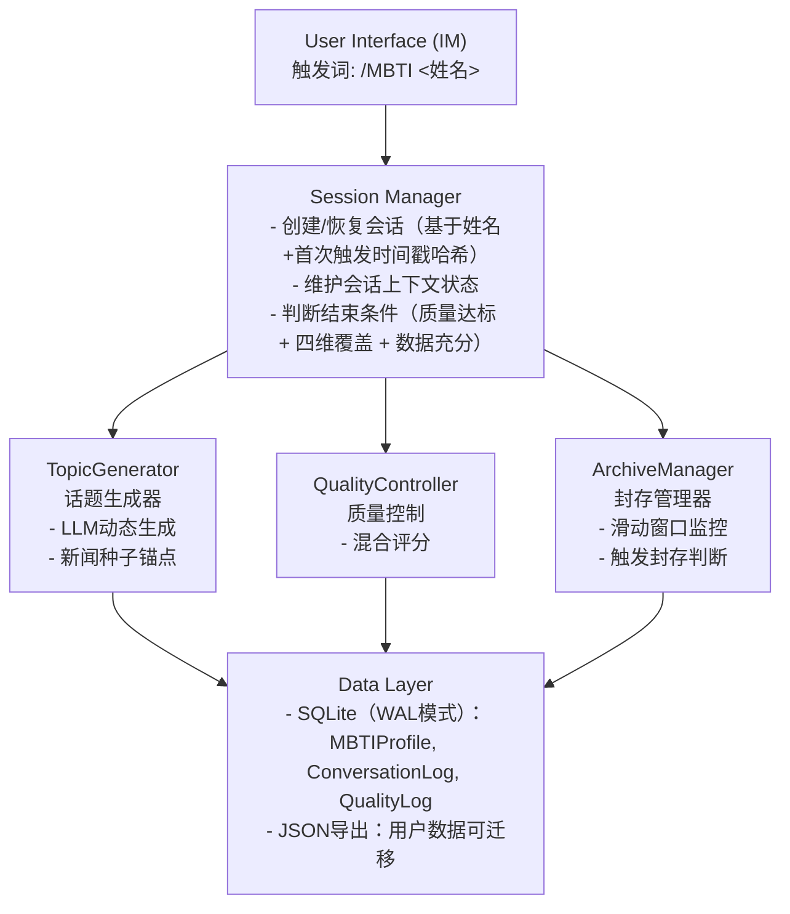

# 系统架构设计

> 版本：v1.0
> 状态：与 DESIGN.md 对齐（设计冻结）
> 更新：2026-06-03

---

## 1. 整体架构



---

## 2. 模块职责

### 2.1 SessionManager（会话管理）

| 职责 | 说明 |
|------|------|
| 用户标识 | 姓名 + 出生年月（YYYYMM） → `user_key` |
| 会话创建 | 姓名 + 首次触发时间戳哈希 → `session_id` |
| 上下文维护 | 继承完整对话历史，支持跨 Session 唤醒 |
| 结束判断 | 质量达标 + 四维覆盖 + 数据充分，三者同时满足 |

**唤醒方案（方案B）**：新 Session 启动时，LLM 压缩前情摘要作为 system prompt，上下文完整继承。

### 2.2 TopicGenerator（话题生成器）

| 职责 | 说明 |
|------|------|
| 动态生成 | LLM 根据当前会话状态动态生成话题 |
| 种子来源 | 从本地种子缓存中按画像筛选 1-2 条摘要作为锚点，24h 失效 |
| 兜底机制 | 允许纯 LLM 生成（零资料），但禁止引用真实具体事件或人物 |
| 维度映射 | 基于会话维度置信度控制重复（置信度高则降低优先级） |

**话题维度**：E/I · S/N · T/F · J/P 四维覆盖，确保分析完整性。

### 2.3 QualityController（质量控制）

| 职责 | 说明 |
|------|------|
| Token 层评分 | 衡量回复内容丰富度 |
| 语义层评分 | 衡量回复质量与相关性 |
| 监控机制 | 滑动窗口，检测质量趋势 |

**评分模型**（与 DESIGN.md 对齐）：
```
综合评分 = Token量分×0.3 + 重复/矛盾分×0.3 + 语义分×0.4
会话级置信度 = 最近 5 轮综合评分的滑动平均
```

**语义分获取**：同一段回答调用 LLM 评分 3 次（温度 0.2），取中位数；异常值按离差规则剔除后取平均。

### 2.4 ArchiveManager（封存管理器）

| 职责 | 说明 |
|------|------|
| 监控策略 | 不干预质量，仅被动监控连续下降 |
| 封存阈值 | `decline_delta >= 0.3` → 严重，下降 2 轮触发 |
| 封存触发 | `0.15 <= decline_delta < 0.3` → 中度，下降 3-4 轮触发 |
| 兜底 | `decline_delta < 0.15` → 轻微，下降 5 轮触发 |

**原则**：保真优先，不追问、不引导，避免引导失真。

### 2.5 WakeupManager（唤醒管理器）

| 职责 | 说明 |
|------|------|
| 唤醒触发 | 新 Session + 识别为已封存用户 |
| 上下文恢复 | 读取封存数据，LLM 压缩前情注入新 Session |
| 状态同步 | 保持用户特征跨会话一致性 |

---

## 3. 数据模型

### 3.1 SQLite 表结构

```sql
-- 用户画像表
CREATE TABLE mbti_profiles (
    user_key       TEXT PRIMARY KEY,   -- 姓名+出生年月（YYYYMM）
    final_type     TEXT,               -- 最终推断的 MBTI 类型（如 INFP）
    confidence     REAL,               -- 置信度 0.0~1.0
    dimensions     TEXT,               -- 四维打分 JSON
    created_at     TEXT,
    updated_at     TEXT,
    archived       INTEGER DEFAULT 0   -- 0=活跃, 1=已封存
);

-- 对话日志表
CREATE TABLE conversation_logs (
    id             INTEGER PRIMARY KEY AUTOINCREMENT,
    user_key       TEXT,
    session_id     TEXT,               -- 姓名+首次触发时间戳哈希
    topic          TEXT,
    user_response  TEXT,
    ai_topic       TEXT,
    timestamp      TEXT,
    FOREIGN KEY (user_key) REFERENCES mbti_profiles(user_key)
);

-- 质量评分日志表
CREATE TABLE quality_logs (
    id             INTEGER PRIMARY KEY AUTOINCREMENT,
    user_key       TEXT,
    session_id     TEXT,               -- 姓名+首次触发时间戳哈希
    token_score    REAL,               -- Token 层评分
    semantic_score REAL,               -- 语义层评分
    confidence     REAL,               -- 综合置信度
    timestamp      TEXT,
    FOREIGN KEY (user_key) REFERENCES mbti_profiles(user_key)
);

-- 种子素材缓存表（用于生成话题的“锚点”，不是静态话题池）
CREATE TABLE seed_topics (
    id             INTEGER PRIMARY KEY AUTOINCREMENT,
    summary        TEXT,
    tags           TEXT,                -- JSON：职业/年龄段/性别等筛选标签
    source         TEXT,                -- 新闻抓取/本地缓存
    created_at     TEXT,
    expires_at     TEXT                 -- 24h 过期
);
```

### 3.2 索引策略

```sql
-- 用户查询加速
CREATE INDEX idx_profiles_user_id ON mbti_profiles(user_id);
CREATE INDEX idx_profiles_archived ON mbti_profiles(archived);

-- 对话历史查询
CREATE INDEX idx_logs_user_id ON conversation_logs(user_id);
CREATE INDEX idx_logs_timestamp ON conversation_logs(timestamp);

-- 质量趋势查询
CREATE INDEX idx_quality_user_id ON quality_logs(user_id);
CREATE INDEX idx_quality_timestamp ON quality_logs(timestamp);
```

---

## 4. 关键设计决策

| 决策 | 选择 | 理由 |
|------|------|------|
| 存储引擎 | SQLite WAL | 单用户文件级数据库，高可靠，迁移成本低 |
| 用户标识 | 姓名+出生年月（YYYYMM） | 便于唤醒与区分同名用户，隐私字段最小化 |
| 会话标识 | 姓名+首次触发时间戳哈希 | 唯一、不可推测、保护隐私 |
| 质量控制 | 被动监控，不干预 | 保真优先，避免引导失真 |
| 话题生成 | LLM 动态 + 新闻种子 | 兼顾质量与时效性 |
| 数据导出 | JSON | 轻量、通用、跨平台迁移 |
| 唤醒方式 | LLM 压缩前情 | 保留上下文，避免信息断层 |

---

## 5. 待定项

- [ ] 话题维度映射框架
- [ ] 动态阈值初始值标定
- [ ] 雷达图维度与输出格式
- [ ] 报告输出结构设计

---

## 6. 目录规划

```
docs/
├── 01-project/
│   ├── README.md              # 文档索引
│   ├── SPEC.md                # 需求与目标
│   ├── IMPLEMENTATION_PLAN.md # 实施方案
│   └── ARCHITECTURE.md        # 本文档 ← 架构设计
├── 02-implementation/         # 各模块详细设计（待撰写）
└── 03-operations/             # 运维文档（数据字典等）
```
